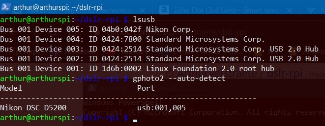

# Install packages
```
sudo apt-get install gphoto2
```

# Before running the script
```
gphoto2 -get-config capturetarget
```
Check the current. If the current is 'Internal RAM', execude next command (replace [choice_number] with the choice number of 'Memory Card'). Otherwise just skip this part
```
gphoto2 -set-config capturetarget=[choice_number]
```

```
chmod +x ./uploadDSLRCaptures.sh
```

# Example of auto-detect DSLR


# Running script
We want the script to run every 30mins, so 30*60=1800.
```
watch -n 1800 ./uploadDSLRCaptures.sh
```

# What I used in this project
- gphoto ([Official Site](http://gphoto.org))
- the Dropbox-Uploader of Andrea Fabrizi ([Github](https://github.com/andreafabrizi/Dropbox-Uploader))
